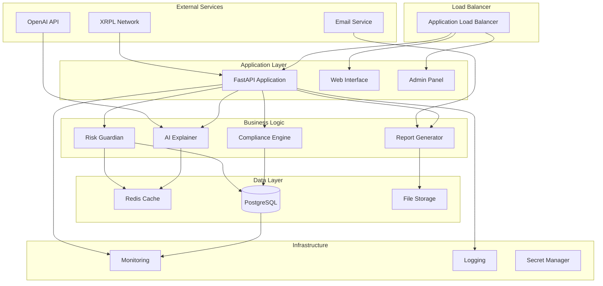

# Klerno Labs - System Architecture

## Overview

Klerno Labs is designed as a modern, cloud-native SaaS platform that combines real-time blockchain data processing with AI-powered risk analysis. The architecture prioritizes scalability, security, and maintainability while ensuring low-latency transaction processing.

## Architecture Principles

### Core Principles
- **Microservices Architecture**: Loosely coupled, independently deployable services
- **Event-Driven Design**: Asynchronous processing with event sourcing
- **API-First**: All functionality exposed through well-designed APIs
- **Security by Design**: Security controls integrated at every layer
- **Observability**: Comprehensive monitoring, logging, and tracing

### Design Goals
- **Performance**: Sub-5-second transaction processing
- **Scalability**: Handle 10,000+ transactions per second
- **Reliability**: 99.9% uptime with automatic failover
- **Security**: Enterprise-grade security controls
- **Maintainability**: Clean code with comprehensive testing

## System Overview



## Component Architecture

### 1. API Gateway Layer

#### FastAPI Application (`app/main.py`)
**Purpose**: Main API server and routing hub
**Responsibilities**:
- HTTP request routing and validation
- Authentication and authorization
- Rate limiting and request throttling
- API documentation generation
- Error handling and response formatting

**Key Features**:
- Async/await for high concurrency
- Automatic OpenAPI documentation
- Dependency injection for services
- Middleware for cross-cutting concerns
- Health checks and monitoring endpoints

#### Security Middleware (`app/hardening.py`)
**Purpose**: Comprehensive security controls
**Responsibilities**:
- CSRF protection with double-submit cookies
- Security headers (CSP, HSTS, X-Frame-Options)
- Request ID generation for traceability
- Input validation and sanitization
- Rate limiting enforcement

### 2. Business Logic Layer

#### Risk Guardian (`app/guardian.py`)
**Purpose**: Real-time transaction risk assessment
**Responsibilities**:
- Risk score calculation (0.0-1.0 scale)
- Pattern recognition and anomaly detection
- Threshold-based alerting
- Risk factor identification
- Historical pattern comparison

**Algorithm Components**:
```python
def score_risk(transaction: Transaction) -> RiskAssessment:
    """
    Multi-factor risk scoring algorithm
    
    Factors considered:
    - Transaction amount vs. historical patterns
    - Address reputation and age
    - Transaction velocity and frequency
    - Time-based patterns (unusual hours)
    - Network analysis (clustering)
    """
    amount_risk = assess_amount_risk(transaction)
    address_risk = assess_address_risk(transaction)
    velocity_risk = assess_velocity_risk(transaction)
    temporal_risk = assess_temporal_risk(transaction)
    
    # Weighted scoring with confidence intervals
    risk_score = weighted_average([
        (amount_risk, 0.3),
        (address_risk, 0.25), 
        (velocity_risk, 0.25),
        (temporal_risk, 0.2)
    ])
    
    return RiskAssessment(
        score=risk_score,
        confidence=calculate_confidence(transaction),
        factors=identify_risk_factors(transaction)
    )
```

#### Compliance Engine (`app/compliance.py`)
**Purpose**: Regulatory compliance automation
**Responsibilities**:
- Transaction categorization per regulations
- AML/CTR threshold monitoring
- Suspicious activity pattern detection
- Regulatory reporting preparation
- Audit trail maintenance

**Compliance Categories**:
- Large Cash Transactions (>$10,000)
- Structured Transactions (layering)
- High-Risk Geography
- Sanctioned Address Detection
- Unusual Transaction Patterns

#### AI Explainer (`app/llm.py`)
**Purpose**: Natural language explanation of risk decisions
**Responsibilities**:
- Risk score interpretation in plain language
- Factor-based explanation generation
- Contextual analysis with historical data
- Confidence level communication
- Interactive Q&A capabilities

### 3. Data Integration Layer

#### XRPL Integration (`app/integrations/xrp.py`)
**Purpose**: Real-time blockchain data ingestion
**Responsibilities**:
- WebSocket connection to XRPL nodes
- Transaction normalization and validation
- Address and account information retrieval
- Historical transaction analysis
- Network status monitoring

**Data Flow**:
```
XRPL Network → WebSocket → Transaction Parser → Risk Engine → Database
```

#### Database Schema
**Primary Tables**:
- `transactions`: Core transaction data
- `risk_assessments`: Risk scores and factors
- `addresses`: Address metadata and reputation
- `alerts`: Generated alerts and notifications
- `users`: User accounts and permissions
- `audit_logs`: System activity tracking

### 4. Storage and Caching

#### PostgreSQL Database
**Purpose**: Primary data persistence
**Configuration**:
- Connection pooling for scalability
- Read replicas for analytics workloads
- Automated backups and point-in-time recovery
- Encryption at rest and in transit

**Performance Optimizations**:
- Strategic indexing on query patterns
- Partitioning for large transaction tables
- Query optimization and EXPLAIN analysis
- Connection pooling and prepared statements

#### Redis Cache
**Purpose**: High-performance caching and session storage
**Use Cases**:
- API response caching
- Session data storage
- Rate limiting counters
- Real-time analytics
- Pub/sub for notifications

## Security Architecture

### Authentication and Authorization

#### Multi-Layer Security
```
Internet → WAF → Load Balancer → API Gateway → Application → Database
   ↓         ↓         ↓             ↓            ↓           ↓
  DDoS    Rate      SSL/TLS      JWT Auth    RBAC      Encryption
 Protection Limiting  Termination  Validation Control    at Rest
```

#### Security Controls
- **API Key Management**: Secure generation, rotation, and revocation
- **JWT Token Authentication**: Stateless authentication with refresh tokens
- **Role-Based Access Control**: Granular permission system
- **CSRF Protection**: Double-submit cookie pattern
- **Input Validation**: Comprehensive sanitization and validation
- **Audit Logging**: Complete activity tracking

### Data Protection

#### Encryption Standards
- **Data at Rest**: AES-256 encryption for database and files
- **Data in Transit**: TLS 1.3 for all communications
- **Key Management**: Hardware security modules (HSM)
- **PII Protection**: Field-level encryption for sensitive data

#### Privacy Controls
- **Data Minimization**: Collect only necessary data
- **Retention Policies**: Configurable data lifecycle management
- **Export Controls**: GDPR-compliant data export
- **Anonymization**: PII removal for analytics

## Scalability Design

### Horizontal Scaling

#### Application Scaling
```
Load Balancer → [API Instance 1] → Database
              → [API Instance 2] → 
              → [API Instance N] → 
```

**Scaling Strategies**:
- Stateless application design
- Container-based deployment (Docker)
- Kubernetes orchestration
- Auto-scaling based on metrics
- Blue-green deployments

#### Database Scaling
- **Read Replicas**: Scale read operations
- **Connection Pooling**: Efficient connection management
- **Query Optimization**: Performance tuning
- **Partitioning**: Distribute data across tables
- **Caching**: Reduce database load

### Performance Optimization

#### Response Time Targets
- **API Endpoints**: <200ms (95th percentile)
- **Dashboard Loading**: <2 seconds
- **Report Generation**: <30 seconds
- **Real-time Alerts**: <5 seconds
- **Bulk Analysis**: <1 minute for 1000 transactions

#### Optimization Techniques
- **Async Processing**: Non-blocking I/O operations
- **Connection Pooling**: Efficient resource utilization
- **Caching Strategies**: Multi-level caching
- **CDN Usage**: Static asset optimization
- **Database Indexing**: Query performance optimization

## Monitoring and Observability

### Application Monitoring

#### Key Metrics
- **Response Times**: API endpoint performance
- **Error Rates**: Success/failure ratios
- **Throughput**: Requests per second
- **Resource Usage**: CPU, memory, disk utilization
- **Business Metrics**: Transactions processed, alerts generated

#### Monitoring Stack
```
Application → Prometheus → Grafana → Alerting
    ↓
Structured → ELK Stack → Dashboards
  Logs
    ↓
Distributed → Jaeger → Trace Analysis
  Tracing
```

### Health Checks

#### Endpoint Health Monitoring
```python
@app.get("/health")
async def health_check():
    """Comprehensive health check endpoint"""
    return {
        "status": "healthy",
        "timestamp": datetime.utcnow(),
        "services": {
            "database": await check_database_health(),
            "cache": await check_redis_health(),
            "xrpl": await check_xrpl_connectivity(),
            "ai_service": await check_ai_service_health()
        },
        "metrics": {
            "response_time": measure_response_time(),
            "error_rate": calculate_error_rate(),
            "throughput": get_current_throughput()
        }
    }
```

## Deployment Architecture

### Cloud Infrastructure

#### AWS Deployment (Recommended)
```
Route 53 (DNS) → CloudFront (CDN) → ALB → ECS Fargate
                                           ↓
RDS PostgreSQL ← ElastiCache Redis ← Application Containers
                                           ↓
S3 (Files) ← CloudWatch (Monitoring) ← ECS Service Discovery
```

#### Container Strategy
- **Docker Images**: Multi-stage builds for optimization
- **Container Registry**: AWS ECR or Docker Hub
- **Orchestration**: ECS Fargate or Kubernetes
- **Service Mesh**: Istio for advanced traffic management
- **CI/CD Pipeline**: GitLab CI or GitHub Actions

### Environment Strategy

#### Environment Separation
- **Development**: Local Docker Compose
- **Staging**: Cloud environment mirroring production
- **Production**: Highly available, multi-AZ deployment
- **DR (Disaster Recovery)**: Cross-region backup environment

#### Configuration Management
- **Environment Variables**: 12-factor app methodology
- **Secret Management**: AWS Secrets Manager or HashiCorp Vault
- **Feature Flags**: Gradual rollout capabilities
- **Configuration Validation**: Startup-time validation

## Data Flow Architecture

### Real-Time Processing Pipeline

```
XRPL Network → WebSocket → Message Queue → Risk Engine → Alert System
                              ↓
                          Database → Analytics → Reports
                              ↓
                          Cache → API → Dashboard
```

#### Processing Stages
1. **Ingestion**: Real-time transaction capture from XRPL
2. **Normalization**: Data transformation and validation
3. **Analysis**: Risk scoring and compliance checking
4. **Storage**: Persistent storage with indexing
5. **Alerting**: Real-time notification system
6. **Reporting**: Batch processing for analytics

### Batch Processing

#### Report Generation
```python
async def generate_compliance_report(date_range: DateRange):
    """
    Asynchronous report generation with progress tracking
    """
    # Query transactions in chunks
    transactions = await fetch_transactions_chunked(date_range)
    
    # Process in parallel
    tasks = [analyze_chunk(chunk) for chunk in chunk_data(transactions)]
    results = await asyncio.gather(*tasks)
    
    # Generate final report
    report = compile_report(results)
    return report
```

## Future Architecture Considerations

### Planned Enhancements

#### Multi-Chain Support
- Pluggable blockchain integration architecture
- Unified transaction model across chains
- Cross-chain transaction tracking
- Chain-specific risk models

#### Advanced Analytics
- Machine learning pipeline integration
- Real-time stream processing (Apache Kafka)
- Graph database for network analysis (Neo4j)
- Time-series database for metrics (InfluxDB)

#### Enterprise Features
- Multi-tenant architecture
- White-label deployment options
- Advanced audit and compliance features
- Integration with enterprise systems (SIEM, etc.)

---

*This architecture documentation is continuously updated as the system evolves. For the latest information, refer to the technical design documents in the engineering team's knowledge base.*